<!-- README.md is generated from README.Rmd. Please edit that file -->

```{r, include = FALSE}
knitr::opts_chunk$set(
  collapse = TRUE,
  comment = "#>",
  fig.path = "man/figures/README-",
  out.width = "100%"
)

library(devout)
library(devoutrgl)
library(ggrgl)
library(ggplot2)
library(raymolecule)
library(dplyr)


if (FALSE) {
  pkgdown::build_site(override = list(destination = "../coolbutuseless.github.io/package/ggrgl"))
}

```


```{r echo = FALSE, eval = FALSE}
systemfonts::system_fonts() %>% 
  filter(grepl("Art", name))


r = 10
theta <- seq(0, 2*pi, length.out = 7) + pi/2

hex <- data.frame(
  x = r * cos(theta),
  y = r * sin(theta)
)

left  <- hex[c(1, 2, 3, 4, 1),]
right <- hex[c(4, 5, 6, 1, 4),]

centroid <- c(5.75, 0)

mid_14    <- colSums(hex[c(1,4),])/2
mid_1cent <- colSums(rbind(hex[1,], centroid))/2
mid_4cent <- colSums(rbind(hex[4,], centroid))/2

north <- rbind(hex[c(1, 6),], centroid)
south <- rbind(hex[c(4, 5),], centroid)
east  <- rbind(hex[c(6, 5),], centroid)
west  <- rbind(hex[c(4, 1),], centroid)

west1 <- as.data.frame(rbind(mid_14, mid_1cent, mid_4cent))
west2 <- as.data.frame(rbind(centroid, mid_1cent, mid_4cent))

sand  <- '#ebd5a8'
green <- '#1d814a'
dark  <- 'grey20'

p <- ggplot() + 
  # geom_polygon(data = hex  , aes(x, y)) +
  geom_polygon(data = left , aes(x, y), colour=NA) + 
  geom_polygon(data = north, aes(x, y), colour=NA, fill = sand) + 
  geom_polygon(data = south, aes(x, y), colour=NA, fill = sand) + 
  geom_polygon(data = east , aes(x, y), colour=NA, fill = dark) + 
  geom_polygon(data = west , aes(x, y), colour=NA, fill = green) + 
  geom_polygon(data = west1, aes(x, y), colour=NA, fill = sand) + 
  geom_polygon(data = west2, aes(x, y), colour=NA, fill = dark) + 
  annotate('text', x=-8.1, y= 2, label = toupper("grammar" ), hjust = 0, colour = green, size = 13, family = 'Futura-Medium') + 
  annotate('text', x=-8.1, y=-0, label = toupper("of 3d"   ), hjust = 0, colour = green, size = 13, family = 'Futura-Medium') + 
  annotate('text', x=-8.1, y=-2, label = toupper("graphics"), hjust = 0, colour = green, size = 13, family = 'Futura-Medium') + 
  annotate('text', x=  2.05, y=0, label =  "GG", colour = green, size = 14, family = 'Futura-CondensedMedium') + 
  annotate('text', x=  4.0, y=0, label = "RGL", colour =  sand, size = 14, family = 'Futura-CondensedMedium') + 
  theme_void() +
  coord_equal() + 
  theme(rect = element_rect(fill = "transparent", colour = NA))

p

ggsave("man/figures/logo.png", width = 8, height = 8)
```


# ggrgl    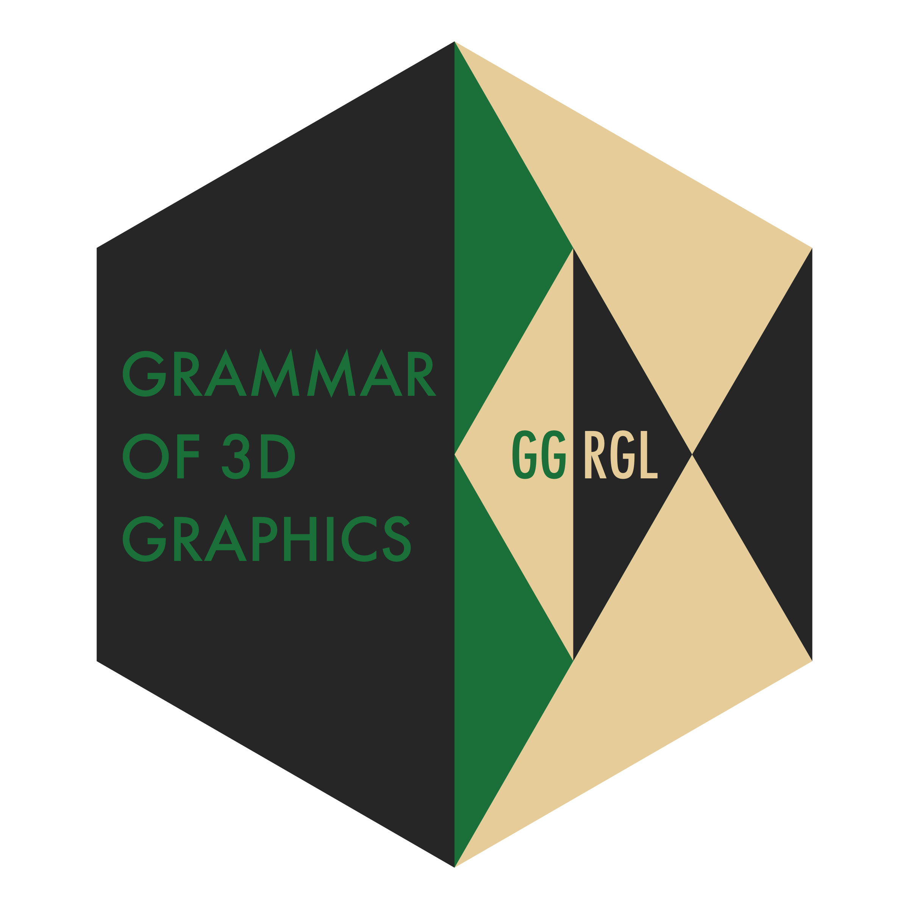

<!-- badges: start -->

[](https://www.tidyverse.org/lifecycle/#experimental)
<!-- badges: end -->


`ggrgl` extends [ggplot2](https://www.tidyverse.org/ggplot2) into the third dimension.

`ggrgl` does this by adding a new **`z`** aesthetic which is respected when a plot 
is rendered to the [{devoutrgl}](https://github.com/coolbutuseless/devoutrgl) device
which renders to OpenGL via [{rgl}](https://cran.r-project.org/web/packages/rgl/index.html).

Because `{devoutrgl}` is an interactive device, the view of the plot may be 
manipulated by the user - zoom, rotate, change field-of-view etc.

#### Slideshow 

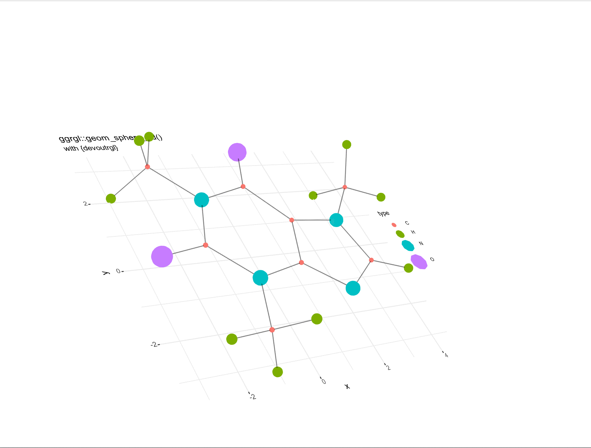

<!-- #### Example Gif -->

<!-- <details open> -->
<!-- <summary> Click to hide/reveal an animated gif of a 3d plot </summary> -->

<!-- 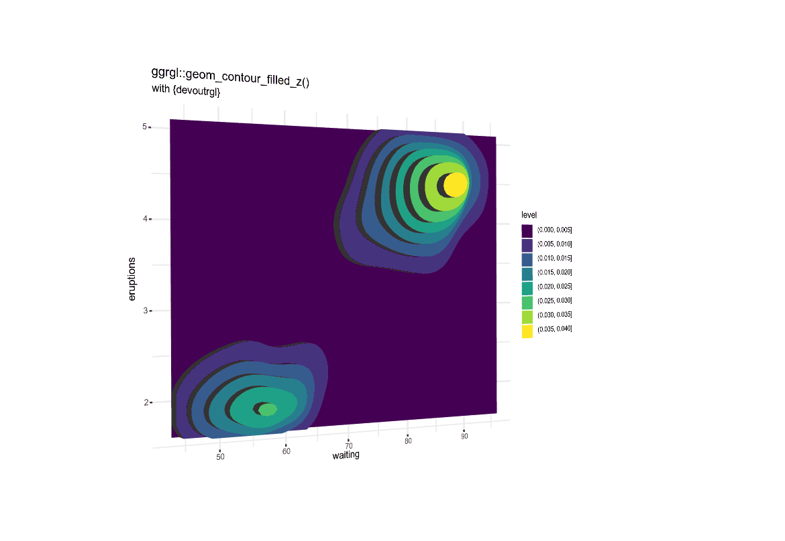 -->

<!-- </details> -->
<!-- <br/> -->

**Note:** interactive 3d plots cannot be displayed in a github README file, and
static images or animated gifs are used here instead.

Visit the [pkgdown online documentation](https://coolbutuseless.github.io/package/ggrgl/) to view plots
which can be manipulated in the browser.


## Installation

A lot of support packages are needed for `ggrgl` - most of which should
already be installed if you have `ggplot`.

Custom packages which are needed (and not currently on CRAN):

* [devout](https://github.com/coolbutuseless/devout) - The core package for
  writing graphics devices using R (rather than C).
* [devoutrgl](https://github.com/coolbutuseless/devoutrgl) - a graphics device 
  which renders to `{rgl}`
* [triangular](https://github.com/coolbutuseless/triangular) - decompaose polygons
  into triangles for 3d rendering. Much faster than `rgl::triangulate()`
* [snowcrash](https://github.com/coolbutuseless/snowcrash) - a package for 
  encoding objects as images - needed to circumvent limitations in the 
  device system provided by R
* [cryogenic](https://github.com/coolbutuseless/cryogenic) - a package for
  capturing a call to be evaluated later.  Calls to generate 3d geometry are
  generated when plot object is created, but not executed until later when
  the plot is actually rendered to screen.

You can install from [GitHub](https://github.com/coolbutuseless/ggrgl) with:

``` r
# install.package('remotes')
remotes::install_github('coolbutuseless/devout')
remotes::install_github('coolbutuseless/devoutrgl')
remotes::install_github('coolbutuseless/triangular')
remotes::install_github('coolbutuseless/snowcrash')
remotes::install_github('coolbutuseless/cryogenic')
remotes::install_github('coolbutuseless/ggrgl', ref='main')
```

New `z` Aesthetic
------------------------------------------------------------------------------

The new `z` aesthetic works the same as the `x` and `y` aesthetics in `ggplot2`.

`z` may be mapped to a data variable or set to a constant.

New Extrusion Aesthetics
------------------------------------------------------------------------------

When graphical elements have a `z` value they are raised above the ground.

By setting `extrude = TRUE` (on geoms which support it), then the raised element
is connected to the ground as if it were extruded from it.

New aesthetics control the appearance of the extruded faces and edges:

| aesthetic           | Description                               | default |
|---------------------|-------------------------------------------|---------|
| extrude_z           | Lower limit of extrusion                  | 0.05    |
| extrude_face_fill   | Extruded face colour                      | grey20  |
| extrude_face_alpha  | Extruded face alpha                       | 1       |
| extrude_edge_colour | Edge colour for extrusion                 | NA      |
| extrude_edge_alpha  | Edge alpha for extrusion                  | 1       |
| extrude_edge_size   | Width of line for extruded edges          | 1       |


3-dimensional Geometry Types: `z` and `3d`
------------------------------------------------------------------------------

`ggrgl` defines 2 classes of geoms: `z` and `3d`

* `z` geoms are identical to their `ggplot2` counterparts, except the entire
  shape may be raised (as a unit) in the z direction.  The resulting geometry
  will still be planar, and parallel to the original plotting surface.
* `3d` geoms allow for full specification of (x, y, z) locations.  Their orientation
  is not constrained to be planar, or parallel to the original plotting surface.


**Click on a geom in the following table to view its vignette**


|ggplot2                |  Planar Z offset        |         3d          |
|:----------------------|:------------------------|:--------------------|
|geom_bar               | [geom_bar_z](https://coolbutuseless.github.io/package/ggrgl/articles/geom-bar-z.html)                           |                     |
|geom_contour           | [geom_contour_z](https://coolbutuseless.github.io/package/ggrgl/articles/geom-contour-z.html)                   |                     |
|geom_contour_filled    | [geom_contour_filled_z](https://coolbutuseless.github.io/package/ggrgl/articles/geom-contour-filled-z.html)     |                     |
|geom_density           | [geom_density_z](https://coolbutuseless.github.io/package/ggrgl/articles/geom-density-z.html)                   |                     |
|geom_line              |                                                                                                                 | [geom_line_3d](https://coolbutuseless.github.io/package/ggrgl/articles/geom-line-3d.html)        |
|geom_path              |                                                                                                                 | [geom_path_3d](https://coolbutuseless.github.io/package/ggrgl/articles/geom-path-3d.html)        |
|geom_point             | [geom_point_z](https://coolbutuseless.github.io/package/ggrgl/articles/geom-point-z.html)                       | [geom_sphere_3d](https://coolbutuseless.github.io/package/ggrgl/articles/geom-sphere-3d.html)      |
|geom_polygon           | [geom_polygon_z](https://coolbutuseless.github.io/package/ggrgl/articles/geom-polygon-z.html)                   |                     |
|geom_rect              | [geom_rect_z](https://coolbutuseless.github.io/package/ggrgl/articles/geom-rect-z.html)                         |                     |
|geom_ribbon            | [geom_ribbon_z](https://coolbutuseless.github.io/package/ggrgl/articles/geom-ribbon-z.html)                     |                     |
|geom_segment           |                         | [geom_segment_3d](https://coolbutuseless.github.io/package/ggrgl/articles/geom-segment-3d.html) |
|geom_text              | [geom_text_z](https://coolbutuseless.github.io/package/ggrgl/articles/geom-text-z.html)                         |                     |
|geom_tile              | [geom_tile_z](https://coolbutuseless.github.io/package/ggrgl/articles/geom-tile-z.html)                         |                     |


Vignettes
------------------------------------------------------------------------------


There are vignettes on all the new geoms in this package, see **links in the table above** or 
**click on an image below**

Some vignettes with some details of the implementation and usage are:

* [Technical Overview](https://coolbutuseless.github.io/package/ggrgl/articles/technical-overview.html)
  gives some details on how the 3d geometry is communicated internally
* [Z Scaling](https://coolbutuseless.github.io/package/ggrgl/articles/details-z-scaling.html) shows examples how
  the scaling of the Z coordinate may be controlled.
* [Keep 2d 'shadows'](https://coolbutuseless.github.io/package/ggrgl/articles/details-keep2d.html) 
  demonstrates how the 2d shadow of 3d geometry may be kept for some supported geoms.


To see all vignettes see the [online documentation](https://coolbutuseless.github.io/package/ggrgl/)

|                   |                       |           |
|:------------------|:----------------------|:----------|
| [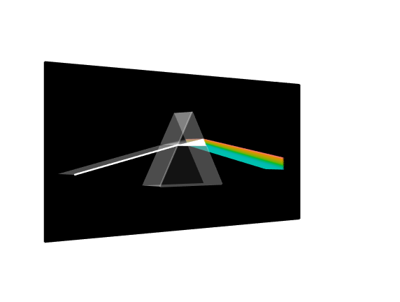](https://coolbutuseless.github.io/package/ggrgl/articles/demo-pink-floyd-dark-side-of-the-moon.html) | [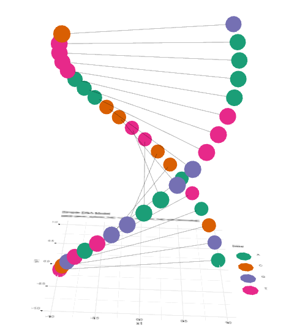](https://coolbutuseless.github.io/package/ggrgl/articles/demo-dna-model.html) | [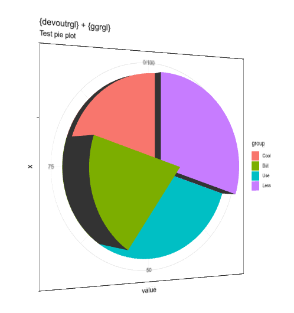](https://coolbutuseless.github.io/package/ggrgl/articles/geom-bar-z.html) |
| [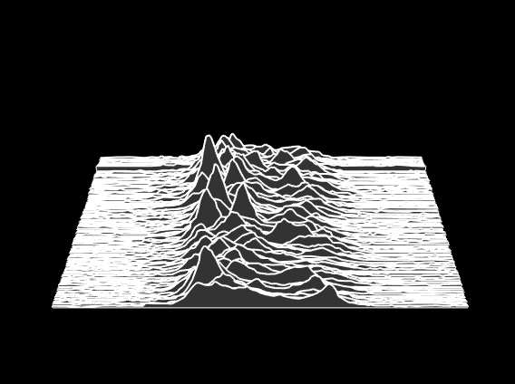](https://coolbutuseless.github.io/package/ggrgl/articles/geom-ribbon-z.html) | [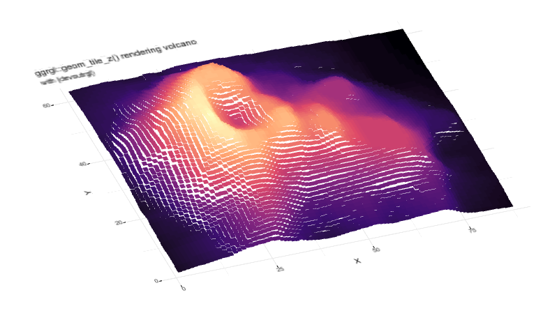](https://coolbutuseless.github.io/package/ggrgl/articles/demo-volcano.html) | [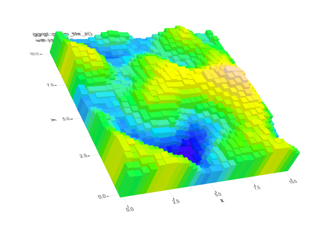](https://coolbutuseless.github.io/package/ggrgl/articles/geom-tile-z.html) |
| [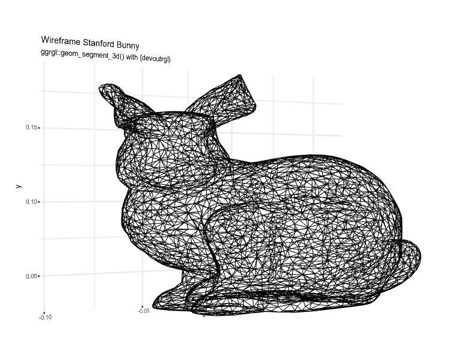](https://coolbutuseless.github.io/package/ggrgl/articles/geom-segment-3d.html) | [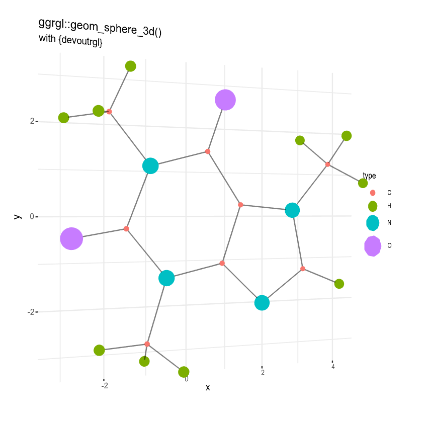](https://coolbutuseless.github.io/package/ggrgl/articles/demo-caffeine-molecule.html) | [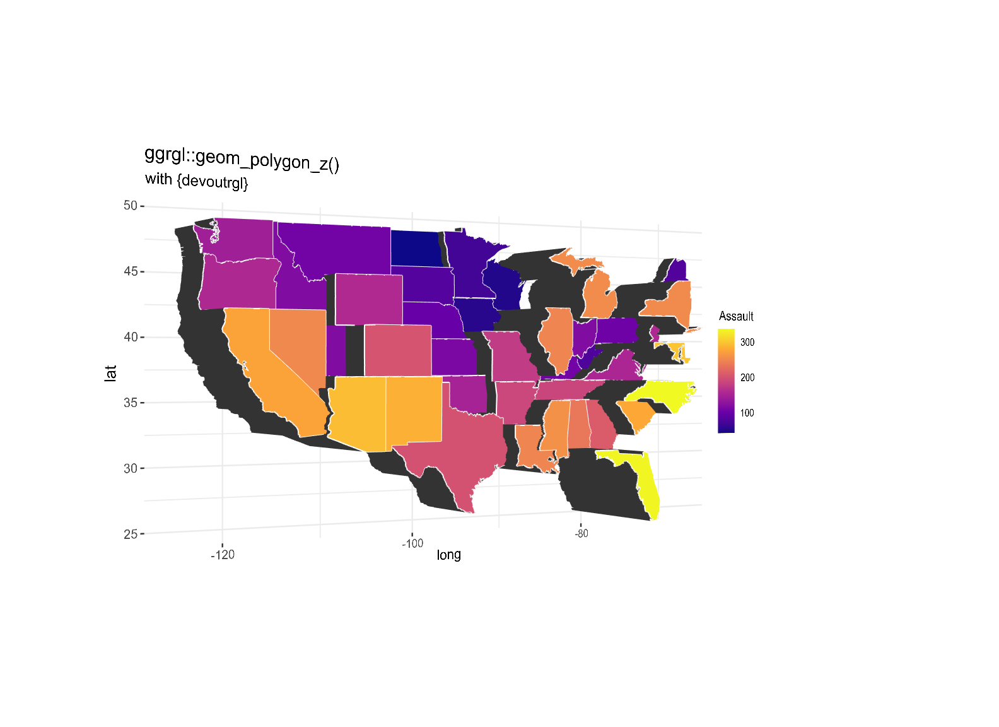](https://coolbutuseless.github.io/package/ggrgl/articles/geom-polygon-z.html) |


Example - A Basic 3d Bar Plot with `geom_bar_z()`
------------------------------------------------------------------------------

```{r eval=FALSE}
#~~~~~~~~~~~~~~~~~~~~~~~~~~~~~~~~~~~~~~~~~~~~~~~~~~~~~~~~~~~~~~~~~~~~~~~~~~~~
# Always explicitly load required packages - there are some possible 
# issues if you don't!
#~~~~~~~~~~~~~~~~~~~~~~~~~~~~~~~~~~~~~~~~~~~~~~~~~~~~~~~~~~~~~~~~~~~~~~~~~~~~
suppressPackageStartupMessages({
  library(rgl)
  library(devout)
  library(devoutrgl)
  library(ggrgl)
  library(ggplot2)
})

#~~~~~~~~~~~~~~~~~~~~~~~~~~~~~~~~~~~~~~~~~~~~~~~~~~~~~~~~~~~~~~~~~~~~~~~~~~~~
# Use `geom_bar_z` and set `z` to 200 and use extrusion
#~~~~~~~~~~~~~~~~~~~~~~~~~~~~~~~~~~~~~~~~~~~~~~~~~~~~~~~~~~~~~~~~~~~~~~~~~~~~
p <- ggplot(mpg) +
  geom_bar_z(aes(x=class, fill=class), colour='black', z=200, extrude=TRUE)


#~~~~~~~~~~~~~~~~~~~~~~~~~~~~~~~~~~~~~~~~~~~~~~~~~~~~~~~~~~~~~~~~~~~~~~~~~~~~
# Render Plot in 3d with {devoutrgl}
#~~~~~~~~~~~~~~~~~~~~~~~~~~~~~~~~~~~~~~~~~~~~~~~~~~~~~~~~~~~~~~~~~~~~~~~~~~~~
devoutrgl::rgldev()
p
invisible(dev.off())
```

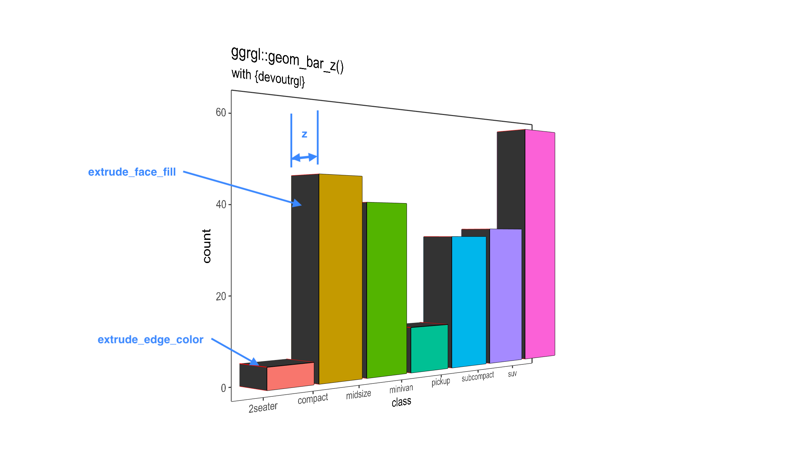


Related Software
------------------------------------------------------------------------------

* [ggplot2](https://ggplot2.tidyverse.org) - a grammar of graphics implementation 
for 2d plots in R.   `ggrgl` would be impossible without `ggplot2` to
build upon.

Acknowledgements
------------------------------------------------------------------------------

* Hadley Wickham, Thomas Lin Pedersen and others for developing and maintaining `ggplot2` 
* Michael Sumner + Tyler Morgan-Wall on twitter for their in-depth technical advice on 
graphics and 3d in R
* R Core for developing and maintaining the language.
* CRAN maintainers, for patiently shepherding packages onto CRAN and maintaining
  the repository
