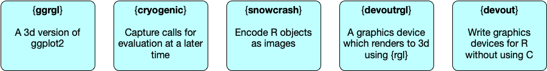
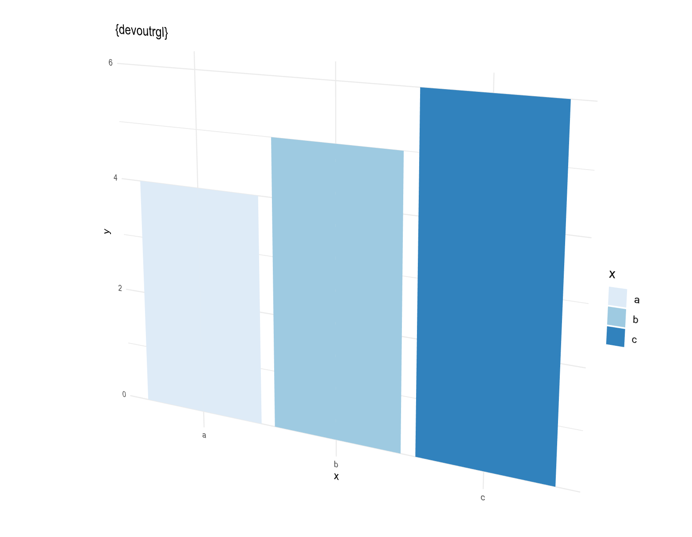
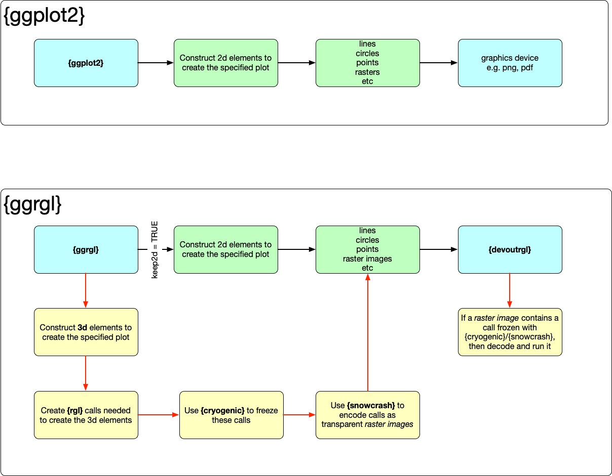

```{r, include = FALSE}
knitr::opts_chunk$set(
  collapse = FALSE,
  comment = "#>",
  fig.width  = 8,
  fig.height = 6
)
library(ggplot2)
library(rgl)
library(ggrgl)
```


Problem Statement: Standard R devices can't do 3d
-----------------------------------------------------------------------------

It is impossible to pass 3d information from a standard plotting package (e.g. base plots, 
or `ggplot2`), to a standard R graphics device e.g. (`png()` or `pdf()`).

It is impossible with standard packages as:

* only 2d primitives are passed through e.g. lines, points, polygons with (x, y)
  positions only
* there is no way to render 3d on a standard graphics device.

Solution Overview
-----------------------------------------------------------------------------


1. Capture calls to evaluate later [`{cryogenic}`](https://github.com/coolbutuseless/cryogenic)
2. Encode arbitrary R objects (including calls) as raster images [`{snowcrash}`](https://github.com/coolbutuseless/snowcrash)
3. A graphics device which supports rendering to 3d [`{devoutrgl}`](https://github.com/coolbutuseless/devoutrgl)
4. A plotting front-end which generates 3d elements [`{ggrgl}`](https://github.com/coolbutuseless/ggrgl)





Solution Part 1: Capture calls to evaluate later (with [`{cryogenic}`](https://github.com/coolbutuseless/cryogenic))
-----------------------------------------------------------------------------

[`{cryogenic}`](https://github.com/coolbutuseless/cryogenic) is an R package
which allows for the creation of calls to functions that will be evaluated at a
later time.

There are built-in facilities in R to do this, but this 3d plotting project needed a bit
more control of when things were being evaluated and meta-information about 
the function call.  Hence `cryogenic` does exactly what's needed to 
generate 3d geometry calls during the plotting process, but not running this
code until the plot is being rendered within the graphics device.

Solution Part 2: Encode R Objects to Images (with [`{snowcrash}`](https://github.com/coolbutuseless/snowcrash))
-----------------------------------------------------------------------------

[`{snowcrash}`](https://github.com/coolbutuseless/snowcrash) is an R package
which encodes aribitrary R objects to images, and can extract them again.

This package allows for passing arbitrary objects from a plotting package to 
a graphics device, by passing them as images.


Solution part 3: A graphics device that renders to 3d (with [`{devoutrgl}`](https://github.com/coolbutuseless/devoutrgl)
-----------------------------------------------------------------------------

[devoutrgl](https://github.com/coolbutuseless/devoutrgl) is a new graphics 
device that renders to a 3d backend via the `{rgl}` package.

When this is paired with a standard R plotting package (e.g. ggplot2) the 
most it can do is render te 2d plot on a surface that can ben manipulated in 3d.



Solution part 4: A plotting package that generates 3d geometric primitives (with [`{ggrgl}`](https://github.com/coolbutuseless/ggrgl))
-----------------------------------------------------------------------------

`{ggrgl}`](https://github.com/coolbutuseless/ggrgl) is a 3d version of `ggplot2`.

When plotting with `ggrgl`, the `z` aesthetic is respected and 3d graphics primitives
are created.

The calls to create 3d primitives are *frozen* with `cryogenic`, converted to an 
image with `snowcrash`, and passed to `devoutrgl` for rendering.

When rendering a plot produced by `ggrgl`, `devoutrgl` will inspect any images
that are part of the plot and determine if there is 3d code encoded within.  It
will then decode the calls contained in the images and generate the 3d objects
to display in `rgl`





